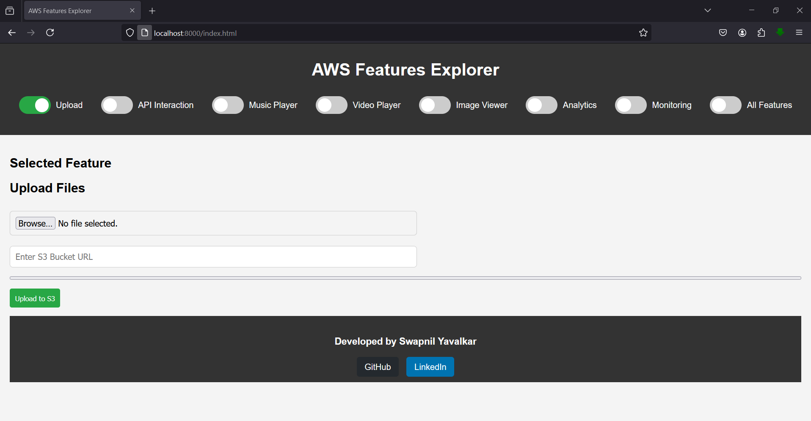

# AWS Features Explorer App 🚀

Welcome to the **AWS Features Explorer App**, your ultimate tool for exploring and interacting with various AWS services in real-world projects. This app serves as a hands-on explorer to simplify AWS integrations and feature usage. It is the go-to application for implementing all the projects mentioned in the [AWS DevOps Real-World Projects](https://github.com/swapnilyavalkar/aws-devops-realworld-projects) repository.

## 🎯 Overview

The **AWS Features Explorer App** is designed to provide a dynamic platform to interact with multiple AWS services. This app helps implement a wide range of AWS features, from file uploads to interacting with API gateways, monitoring, and much more.

Whether you're working on infrastructure projects, deploying microservices, or running analytics, this app enables you to quickly and efficiently manage these tasks using a simple UI.

### 🔑 Features

- **File Upload to S3**: Seamlessly upload files to an S3 bucket.
- **API Gateway Interaction**: Post data to AWS API Gateway endpoints.
- **Music & Video Players**: Stream audio and video files directly from S3 or other external sources.
- **Image Viewer**: View images hosted on S3 or any URL.
- **Run Athena Queries**: Execute SQL-like queries using Amazon Athena for analytics.
- **CloudWatch Monitoring**: Visualize metrics using CloudWatch for real-time monitoring.
- **All-in-One Feature Toggle**: Enable or disable multiple features with a simple toggle switch.

### 🗂️ Directory Structure

```bash
aws-features-explorer-app
│
├── css/
│   └── style.css             # Styles for the app
│
├── js/
│   ├── apiHandler.js         # Handles API Gateway interactions
│   └── main.js               # Main logic to control app features
│
├── screenshots/
│   └── home-page.png         # Screenshot of the homepage
│
├── index.html                # Main HTML file
├── LICENSE                   # License file
└── README.md                 # You're reading this file!
```

### 🛠️ How to Use This App

#### Clone the Repository

To get started with the **AWS Features Explorer App**, clone the repository from GitHub:

```bash

# Clone repository
git clone https://github.com/swapnilyavalkar/aws-features-explorer-app.git
cd aws-features-explorer-app

# Update and install Nginx
sudo apt update
sudo apt install nginx -y

# Start and enable Nginx
sudo systemctl start nginx
sudo systemctl enable nginx

# Allow HTTP traffic if UFW is enabled
sudo ufw allow 'Nginx Full'

# Remove default Nginx content and copy your app files
sudo rm -rf /var/www/html/*
sudo cp -r /path/to/aws-features-explorer-app/* /var/www/html/

# Set correct permissions
sudo chown -R www-data:www-data /var/www/html
sudo chmod -R 755 /var/www/html

# Restart Nginx to apply changes
sudo systemctl restart nginx

```


#### Run the App Locally

Simply launch the app locally and start exploring various AWS services.

- Local access: http://localhost
- Public access: http://your-server-ip

#### Use the Docker Image

You can also use the Docker image of this app to run it in any environment that supports Docker:

1. Pull the Docker image from [Docker Hub](https://hub.docker.com/repository/docker/swapnilyavalkar/aws-features-explorer-app/):

    ```bash
    docker pull swapnilyavalkar/aws-features-explorer-app
    ```

2. Run the Docker container:

    ```bash
    docker run -d -p 8080:80 swapnilyavalkar/aws-features-explorer-app
    ```

3. Open your browser and navigate to `http://localhost:8080` to start using the app.

### 🌟 Example Use Cases

Here are a couple of examples of how you can use this app for implementing real-world projects from the [AWS DevOps Real-World Projects](https://github.com/swapnilyavalkar/aws-devops-realworld-projects) repository:

#### 1. **S3 Upload for Project X:**
   - Use the **File Upload to S3** feature to directly upload files from the UI to an S3 bucket as part of your project's storage solution.

#### 2. **API Gateway for Project Y:**
   - Interact with AWS API Gateway using the **API Interaction** feature to simulate RESTful API calls and manage integrations.

### 🌍 Features for AWS Services

- **S3**: Upload, store, and retrieve files.
- **API Gateway**: Easily manage and interact with APIs.
- **CloudWatch**: View real-time monitoring data for AWS resources.
- **Athena**: Run SQL queries for large datasets and analytics.
- **Multimedia Streaming**: Stream music and video files for media-based projects.
- **Image Viewer**: Load and preview images hosted on AWS.

### 🔥 Why Choose This App?

- **Simple and Efficient**: Minimal setup required to interact with complex AWS services.
- **Dynamic and Versatile**: Built with a focus on real-world AWS DevOps use cases.
- **Docker-Ready**: Easily deploy and scale using the Docker image.
- **Supports Multiple Projects**: Directly integrates with all projects in the [AWS DevOps Real-World Projects](https://github.com/swapnilyavalkar/aws-devops-realworld-projects) repository.

### 📸 Screenshots



---

## License

This project is licensed under the MIT License. See the [LICENSE](./LICENSE) file for more details.

---

If you have any questions or feedback, feel free to reach out or open an issue in the repository. We hope this app serves as a valuable tool in your AWS and DevOps journey!
